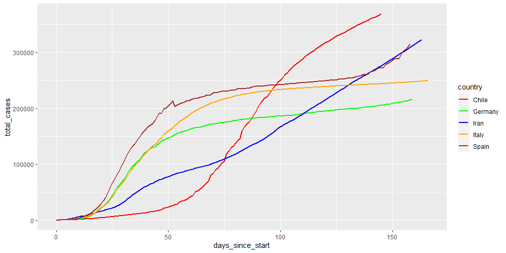
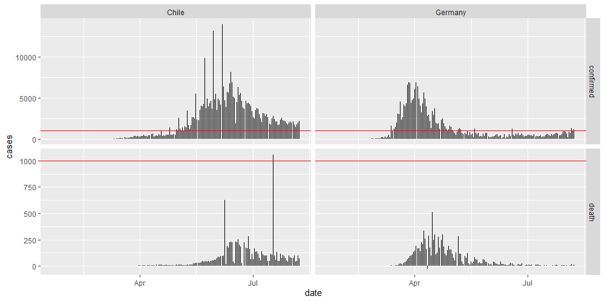

# Coronavirus

A short code to review current Coronavirus cases in selected countries of interest.

In specific I am interested in how the countries with most cases are developing, and compare this to Chile where I currently live.
Secondly, it is also interesting to compare Chile to the rest of Latin America.

I load the data from the package Coronavirus from RamiKrispin ([link](https://github.com/RamiKrispin/coronavirus)) which pulls the data daily from the Johns Hopkins University Center for Systems Science and Engineering.

This is how the cases looked like two months later:

